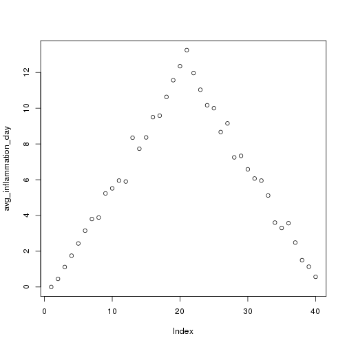

Introduction to R Programming
========================================================
author: Chris Cole
date: January 2017
autosize: true

RStudio
==============================

### Learning Objectives

- Familiarity with the RStudio IDE
- Set up a working directory with version control
- Introduce R syntax
- (Introduce package management)

RStudio
==============================

RStudio is:
- An Integrated Development Enviroment (IDE)
- Open source & free (can buy commercial support)
- Better than commercial alternatives
- Available on all platforms
- Widely used, good community
- ***Awesome***!


"But I Already Know Excel!"
====================================


Excel has its uses, but is not consistent with *reproducibility*.

Best Practices
================

- No single 'best' way - only good principles
- Treat your data as read only (separate file/folder)
 - (cf. Excel's interactive modification)
- Data cleaning
 - Keep 'cleaned' data in a separate folder
- All generated output should be considered disposable

Live Presentation - Rstudio overview
===============================


Live Presentaion - Creating a new project
===========

Projects allow to keep your work within a single workspace.
* you can have multiple projects and switch between them easily
* integrates well with git

Let's create a new project, which uses git for version control.


Exercise 1 - Your turn
===================

- Download gapminder-FiveYearData.csv and inflammation-01.csv to **data** subfolder (link on Etherpad)
- Create a new subdirectory called **graphs** in your working folder
- Modify **.gitignore** so that Git does not track the **graphs/** folder
- Commit these changes to the local repository

(10min)


Live Presentation - Loading Data
=====================
incremental: true

Unlike Excel data are rarely input manually. In fact, it's very tedious to do so. Far more common to read in data from a (text) file.


```r
read.csv(file = "data/inflammation-01.csv", header = FALSE)
```

- latest versions of RStudio (v1.0 and later) has a wizard which helps read in different file types (e.g. Excel)

Exercise 2 - Data in different formats
======================
incremental: true

Using the help documentation what options would you use to open a file with comma as the decimal point character and semi-colon (;) as the field separator?

(5min)


```r
read.csv(file='file.csv', sep=';', dec=',')
```

Live Presentation - Variables
=======================
incremental: true

Data needs to be stored in variables in order to be able to work with it.


```r
weight_kg <- 55
weight_kg
```

```
[1] 55
```


```r
# weight in pounds
2.2 * weight_kg
```

```
[1] 121
```

====================
incremental: true

Continued...


```r
weight_lb <- 2.2 * weight_kg
weight_lb
```

```
[1] 121
```

What happens when we change a variable?


```r
weight_kg <- 57.5
weight_lb
```

```
[1] 121
```

Live Presentation - Reading data
================
incremental: true

Do the same as before, except now store the data:

```r
dat <- read.csv(file = "data/inflammation-01.csv", header = FALSE)
```


```r
head(dat)
```

```
  V1 V2 V3 V4 V5 V6 V7 V8 V9 V10 V11 V12 V13 V14 V15 V16 V17 V18 V19 V20
1  0  0  1  3  1  2  4  7  8   3   3   3  10   5   7   4   7   7  12  18
2  0  1  2  1  2  1  3  2  2   6  10  11   5   9   4   4   7  16   8   6
3  0  1  1  3  3  2  6  2  5   9   5   7   4   5   4  15   5  11   9  10
4  0  0  2  0  4  2  2  1  6   7  10   7   9  13   8   8  15  10  10   7
5  0  1  1  3  3  1  3  5  2   4   4   7   6   5   3  10   8  10   6  17
6  0  0  1  2  2  4  2  1  6   4   7   6   6   9   9  15   4  16  18  12
  V21 V22 V23 V24 V25 V26 V27 V28 V29 V30 V31 V32 V33 V34 V35 V36 V37 V38
1   6  13  11  11   7   7   4   6   8   8   4   4   5   7   3   4   2   3
2  18   4  12   5  12   7  11   5  11   3   3   5   4   4   5   5   1   1
3  19  14  12  17   7  12  11   7   4   2  10   5   4   2   2   3   2   2
4  17   4   4   7   6  15   6   4   9  11   3   5   6   3   3   4   2   3
5   9  14   9   7  13   9  12   6   7   7   9   6   3   2   2   4   2   0
6  12   5  18   9   5   3  10   3  12   7   8   4   7   3   5   4   4   3
  V39 V40
1   0   0
2   0   1
3   1   1
4   2   1
5   1   1
6   2   1
```


Live Presentation - Manipulating data
=========================

Get basic info on data


```r
class(dat)
dim(dat)
length(dat)
nrow(dat)
```

Explore data:

Using the square bracket notation; '[]'


```r
# First value in dat
dat[1,1]
# middle value
dat[30,20]
```

=========


```r
# select range of values
dat[1:4,1:4]
# select specific values
dat[c(3, 8, 37, 56), c(10, 14, 29)]
# select whole rows/columns
dat[5,]
dat[,16]
```

Live Presentation - Working with the data
===================

Can also run calculations, functions on the data and subsets:


```r
# largest value in all the data
max(dat)
# max inflammation for patient 2
max(dat[2, ])
# minimum inflammation on day 7
min(dat[, 7])
# mean inflammation on day 7
mean(dat[, 7])
# standard deviation of inflammation on day 7
sd(dat[, 7])
```

Live Presentation - Repetitive calculations
==================
incremental: true

We really don't want to summarise each patient or each day by hand do we?

Unsurprisingly R has ways to help you and often multiple ways to do the same thing.

How to find mean inflammation for each patient or each day?


```r
# apply() function MARGIN=1 means rows and MARGIN=2 means columns
avg_inflammation_patient <- apply(X=dat, MARGIN=1, FUN=mean)
```

```r
# with most R functions can omit argument names as long as order is correct
avg_inflammation_day <- apply(dat, 2, mean)
```

===========

...or can use built-in functions.


```r
avg_inflammation_patient <- rowMeans(dat)
avg_inflammation_day <- colMeans(dat)
```


Exercise 3 - over to you
====================

Given this vector:


```r
animal <- c("m", "o", "n", "k", "e", "y")
```

Generate slices which do each of the following:
- The first three characters
- The last three characters
- The first three characters in *reverse order*
- What does animal[-1] do? And animal[-4]?
- Can you explain what animal[-1:-4] does?

(5 min)


Exercise 3 - answers
===============
incremental: true


```r
# first three characters
animal[1:3]
# last three characters
animal[4:6]
# first three in reverse
animal[3:1]
```


```r
animal[-1:-4]
```

```
[1] "e" "y"
```

Exercise 4 - Inflammation data
================

Using the inflammation data frame dat from above: Let’s pretend there was something wrong with the instrument on the first five days for every second patient (#2, 4, 6, etc.), which resulted in the measurements being twice as large as they should be.

1. Write a vector containing each affected patient (hint: ? seq)
2. Create a new data frame in which you halve the first five days’ values in only those patients
3. Print out the corrected data frame to check that your code has fixed the problem

(10min)


Exercise 4 - answer
=================


```r
whichPatients <- seq(2,40,2)
whichDays <- c(1:5)
dat2 <- dat
dat2[whichPatients,whichDays] <- dat2[whichPatients,whichDays]/2
(dat2)
```

```
   V1  V2  V3  V4  V5 V6 V7 V8 V9 V10 V11 V12 V13 V14 V15 V16 V17 V18 V19
1   0 0.0 1.0 3.0 1.0  2  4  7  8   3   3   3  10   5   7   4   7   7  12
2   0 0.5 1.0 0.5 1.0  1  3  2  2   6  10  11   5   9   4   4   7  16   8
3   0 1.0 1.0 3.0 3.0  2  6  2  5   9   5   7   4   5   4  15   5  11   9
4   0 0.0 1.0 0.0 2.0  2  2  1  6   7  10   7   9  13   8   8  15  10  10
5   0 1.0 1.0 3.0 3.0  1  3  5  2   4   4   7   6   5   3  10   8  10   6
6   0 0.0 0.5 1.0 1.0  4  2  1  6   4   7   6   6   9   9  15   4  16  18
7   0 0.0 2.0 2.0 4.0  2  2  5  5   8   6   5  11   9   4  13   5  12  10
8   0 0.0 0.5 1.0 1.5  1  2  3  5   3   7   8   8   5  10   9  15  11  18
9   0 0.0 0.0 3.0 1.0  5  6  5  5   8   2   4  11  12  10  11   9  10  17
10  0 0.5 0.5 1.0 0.5  3  5  3  5   8   6   8  12   5  13   6  13   8  16
11  0 1.0 0.0 0.0 4.0  3  3  5  5   4   5   8   7  10  13   3   7  13  15
12  0 0.5 0.0 0.0 1.5  4  2  7  8   5   2   8  11   5   5   8  14  11   6
13  0 0.0 2.0 1.0 4.0  3  6  4  6   7   9   9   3  11   6  12   4  17  13
14  0 0.0 0.0 0.0 0.5  3  1  6  6   5   5   6   3   6  13   3  10  13   9
15  0 1.0 2.0 1.0 1.0  1  4  1  5   2   3   3  10   7  13   5   7  17   6
16  0 0.5 0.5 0.0 0.5  2  4  3  6   4   7   5   5   7   5  10   7   8  18
17  0 0.0 0.0 0.0 2.0  3  6  5  7   4   3   2  10   7   9  11  12   5  12
18  0 0.0 0.0 0.5 1.0  1  4  3  6   7   4   2  12   6  12   4  14   7   8
19  0 0.0 2.0 1.0 2.0  5  4  2  7   8   4   7  11   9   8  11  15  17  11
20  0 0.5 1.0 0.0 0.5  4  3  2  2   7   3   3  12  13  11  13   6   5   9
21  0 1.0 1.0 3.0 1.0  4  4  1  8   2   2   3  12  12  10  15  13   6   5
22  0 0.0 1.0 1.5 1.0  3  2  6  3   8   7   4   6   6   9   5  12  12   8
23  0 0.0 0.0 3.0 4.0  5  1  7  7   8   2   5  12   4  10  14   5   5  17
24  0 0.5 0.5 0.5 0.5  3  3  2  6   3   9   7   8   8   4  13   7  14  11
25  0 1.0 1.0 1.0 2.0  3  5  3  6   3   7  10   3   8  12   4  12   9  15
26  0 0.0 1.0 0.5 1.5  3  2  7  4   4   3   8  12   9  12   9   5  16   8
27  0 0.0 1.0 2.0 4.0  2  2  3  5   7  10   5   5  12   3  13   4  13   7
28  0 0.0 0.5 0.5 0.5  5  1  5  2   2   4  10   4   8  14   6  15   6  12
29  0 0.0 2.0 2.0 3.0  4  6  3  7   6   4   5   8   4   7   7   6  11  12
30  0 0.0 0.0 0.5 2.0  4  6  3  8   6   4  10  12   3   3   6   8   7  17
31  0 1.0 1.0 0.0 3.0  2  4  6  8   6   2   3  11   3  14  14  12   8   8
32  0 0.0 1.0 1.5 1.5  4  5  3  6   7  10   5  10  13  14   3   8  10   9
33  0 1.0 2.0 2.0 2.0  3  6  6  6   7   6   3  11  12  13  15  15  10  14
34  0 0.0 1.0 0.5 1.5  5  6  7  5   8   9   3  12  10  12   4  12   9  13
35  0 0.0 1.0 2.0 4.0  1  5  5  2   3   4   8   8  12   5  15   9  17   7
36  0 0.0 0.0 1.5 0.5  3  6  4  3   4   8   3   4   8   3  11   5   7  10
37  0 1.0 2.0 2.0 2.0  5  5  1  4   6   3   6   5   9   6   7   4   7  16
38  0 0.5 0.5 1.0 1.5  1  5  1  2   2   5   7   6   6   5  10   6   7  17
39  0 1.0 0.0 3.0 2.0  4  1  1  5   9  10   7  12  10   9  15  12  13  13
40  0 0.5 0.5 1.5 0.5  1  5  5  3   7   2   2   3  12   4   6   8  15  16
41  0 0.0 0.0 2.0 2.0  1  3  4  5   5   6   5   5  12  13   5   7   5  11
42  0 0.0 1.0 3.0 3.0  1  2  1  8   9   2   8  10   3   8   6  10  13  11
43  0 1.0 1.0 3.0 4.0  5  2  1  3   7   9   6  10   5   8  15  11  12  15
44  0 0.0 1.0 3.0 1.0  4  3  6  7   8   5   7  11   3   6  11   6  10   6
45  0 1.0 1.0 3.0 3.0  4  4  6  3   4   9   9   7   6   8  15  12  15   6
46  0 1.0 2.0 2.0 4.0  3  1  4  8   9   5  10  10   3   4   6   7  11  16
47  0 0.0 2.0 3.0 4.0  5  4  6  2   9   7   4   9  10   8  11  16  12  15
48  0 1.0 1.0 3.0 1.0  4  6  2  8   2  10   3  11   9  13  15   5  15   6
49  0 0.0 1.0 3.0 2.0  5  1  2  7   6   6   3  12   9   4  14   4   6  12
50  0 0.0 1.0 2.0 3.0  4  5  7  5   4  10   5  12  12   5   4   7   9  18
51  0 1.0 2.0 1.0 1.0  3  5  3  6   3  10  10  11  10  13  10  13   6   6
52  0 1.0 2.0 2.0 3.0  5  2  4  5   6   8   3   5   4   3  15  15  12  16
53  0 0.0 0.0 2.0 4.0  4  5  3  3   3  10   4   4   4  14  11  15  13  10
54  0 0.0 2.0 1.0 1.0  4  4  7  2   9   4  10  12   7   6   6  11  12   9
55  0 1.0 2.0 1.0 1.0  4  5  4  4   5   9   7  10   3  13  13   8   9  17
56  0 0.0 1.0 3.0 2.0  3  6  4  5   7   2   4  11  11   3   8   8  16   5
57  0 1.0 1.0 2.0 2.0  5  1  7  4   2   5   5   4   6   6   4  16  11  14
58  0 1.0 1.0 1.0 4.0  1  6  4  6   3   6   5   6   4  14  13  13   9  12
59  0 0.0 0.0 1.0 4.0  5  6  3  8   7   9  10   8   6   5  12  15   5  10
60  0 0.0 1.0 0.0 3.0  2  5  4  8   2   9   3   3  10  12   9  14  11  13
   V20 V21 V22 V23 V24 V25 V26 V27 V28 V29 V30 V31 V32 V33 V34 V35 V36 V37
1   18   6  13  11  11   7   7   4   6   8   8   4   4   5   7   3   4   2
2    6  18   4  12   5  12   7  11   5  11   3   3   5   4   4   5   5   1
3   10  19  14  12  17   7  12  11   7   4   2  10   5   4   2   2   3   2
4    7  17   4   4   7   6  15   6   4   9  11   3   5   6   3   3   4   2
5   17   9  14   9   7  13   9  12   6   7   7   9   6   3   2   2   4   2
6   12  12   5  18   9   5   3  10   3  12   7   8   4   7   3   5   4   4
7    6   9  17  15   8   9   3  13   7   8   2   8   8   4   2   3   5   4
8   19  20   8   5  13  15  10   6  10   6   7   4   9   3   5   2   5   3
9   11   6  16  12   6   8  14   6  13  10  11   4   6   4   7   6   3   2
10   8  18  15  16  14  12   7   3   8   9  11   2   5   4   5   1   4   1
11  18   8  15  15  16  11  14  12   4  10  10   4   3   4   5   5   3   3
12  11   9  16  18   6  12   5   4   3   5   7   8   3   5   4   5   5   4
13  15  13  12   8   7   4   7  12   9   5   6   5   4   7   3   5   4   2
14  16  15   9  11   4   6   4  11  11  12   3   5   8   7   4   6   4   1
15   9  12  13  10   4  12   4   6   7   6  10   8   2   5   1   3   4   2
16  17   9   8  12  11  11  11  14   6  11   2  10   9   5   6   5   3   4
17   9  13  19  14  17   5  13   8  11   5  10   9   8   7   5   3   1   4
18  14  13  19   6   9  12   6   4  13   6   7   2   3   6   5   4   2   3
19  12   7  12   7   6   7   4  13   5   7   6   6   9   2   1   1   2   2
20  16   9  19  16  11   8   9  14  12  11   9   6   6   6   1   1   2   4
21   5  18  19   9   6  11  12   7   6   3   6   3   2   4   3   1   5   4
22   5  12  10  16   7  14  12   5   4   6   9   8   5   6   6   1   4   3
23  13  16  15  13   6  12   9  10   3   3   7   4   4   8   2   6   5   1
24  15  14  13   5  13   7  14   9  10   5  11   5   3   5   1   1   4   4
25   5  17  16   5  10  10  15   7   5   3  11   5   5   6   1   1   1   1
26  17   7  11  14   7  13  11   7  12  12   7   8   5   7   2   2   4   1
27  15   9  12  18  14  16  12   3  11   3   2   7   4   8   2   2   1   3
28  15  15  13   7  17   4   5  11   4   8   7   9   4   5   3   2   5   4
29  19  20  18   9   5   4   7  14   8   4   3   7   7   8   3   5   4   1
30  16  14  15  17   4  14  13   4   4  12  11   6   9   5   5   2   5   2
31  16  13   7   6   9  15   7   6   4  10   8  10   4   2   6   5   5   2
32   9  19  15  15   6   8   8  11   5   5   7   3   6   6   4   5   2   2
33  11  11   8   6  12  10   5  12   7   7  11   5   8   5   2   5   5   2
34  10  10   6  10  11   4  15  13   7   3   4   2   9   7   2   4   2   1
35  19  14  18  12  17  14   4  13  13   8  11   5   6   6   2   3   5   2
36   5  15   9  16  17  16   3   8   9   8   3   3   9   5   1   6   5   4
37   7  16  13   9  16  12   6   7   9  10   3   6   4   5   4   6   3   4
38  13  15  16  17  14   4   4  10  10  10  11   9   9   5   4   4   2   1
39   6  19   9  10   6  13   5  13   6   7   2   5   5   2   1   1   1   1
40  16  15   4  14   5  13  10   7  10   6   3   2   3   6   3   3   5   4
41  15  18   7   9  10  14  12  11   9  10   3   2   9   6   2   2   5   3
42  17  19   6   4  11   6  12   7   5   5   4   4   8   2   6   6   4   2
43   6  12  16   6   4  14   3  12   9   6  11   5   8   5   5   6   1   2
44  19  18  14   6  10   7   9   8   5   8   3  10   2   5   1   5   4   2
45  11   6  18   5  14  15  12   9   8   3   6  10   6   8   7   2   5   4
46   6  14   9  11  10  10   7  10   8   8   4   5   8   4   4   5   2   4
47  17  19  10  18  13  15  11   8   4   7  11   6   7   6   5   1   3   1
48  10  10   5  14  15  12   7   4   5  11   4   6   9   5   6   1   1   2
49   9  12   7  11   7  16   8  13   6   7   6  10   7   6   3   1   5   4
50  16  16  10  15  15  10   4   3   7   5   9   4   6   2   4   1   4   2
51  14   5   4   5   5   9   4  12   7   7   4   7   9   3   3   6   3   4
52   7  20  15  12   8   9   6  12   5   8   3   8   5   4   1   3   2   1
53  14  11  17   9  11  11   7  10  12  10  10  10   8   7   5   2   2   4
54  15  15   6   6  13   5  12   9   6   4   7   7   6   5   4   1   4   2
55  16  16  15  12  13   5  12  10   9  11   9   4   5   5   2   2   5   1
56  13  16   5   8   8   6   9  10  10   9   3   3   5   3   5   4   5   3
57  16  14  14   8  17   4  14  13   7   6   3   7   7   5   6   3   4   2
58  19   9  10  15  10   9  10  10   7   5   6   8   6   6   4   3   5   2
59   5   8  13  18  17  14   9  13   4  10  11  10   8   8   6   5   5   2
60   8   6  18  11   9  13  11   8   5   5   2   8   5   3   5   4   1   3
   V38 V39 V40
1    3   0   0
2    1   0   1
3    2   1   1
4    3   2   1
5    0   1   1
6    3   2   1
7    1   1   1
8    2   2   1
9    1   0   0
10   2   0   0
11   2   2   1
12   0   1   1
13   3   0   1
14   3   0   0
15   0   2   0
16   2   2   0
17   0   2   1
18   0   1   0
19   0   1   0
20   3   1   1
21   2   2   0
22   0   2   0
23   0   1   0
24   1   2   0
25   0   2   1
26   1   1   0
27   0   1   1
28   3   2   1
29   3   1   0
30   1   0   1
31   3   2   1
32   3   0   0
33   0   2   1
34   2   1   1
35   1   1   1
36   2   2   0
37   3   2   1
38   0   1   0
39   3   0   1
40   3   2   1
41   0   0   1
42   2   0   0
43   1   2   0
44   1   0   1
45   3   1   1
46   1   1   0
47   0   0   0
48   1   2   1
49   3   0   0
50   2   2   1
51   1   2   0
52   3   1   0
53   1   2   1
54   2   2   1
55   0   0   1
56   3   0   1
57   2   1   1
58   1   1   1
59   0   2   0
60   1   1   0
```

Live Presentation - Basic plotting
==================

> “The purpose of computing is insight, not numbers.” -  Richard Hamming

To get true insight into data you need to visualise it.

========

Plot mean inflammation by day.


```r
plot(avg_inflammation_day)
```



========

Plot max inflammation by day.


```r
max_day_inflammation <- apply(dat, 2, max)
plot(max_day_inflammation)
```


========

Plot min inflammation by day.


```r
plot(apply(dat,2,min)) # <- look 3 functions in one!
```


Exercise 5
=======

Plot SD inflammation data by day.

(5 min)


Summary
========

- Use variable <- value to assign a value to a variable in order to record it in memory.
- Objects are created on demand whenever a value is assigned to them.
- The function dim gives the dimensions of a data frame.
- Use object[x, y] to select a single element from a data frame.
- Use from:to to specify a sequence that includes the indices from to.
- All the indexing and slicing that works on data frames also works on vectors.

Summary
==========
- Use # to add comments to programs.
- Use mean, max, min and sd to calculate simple statistics.
- Use apply to calculate statistics across the rows or columns of a data frame.
- Use plot to create simple visualizations.

New Topic - Writing functions
==========
incremental: true

As we've seen functions allow you to do more complex commands in one go. That would be useful to do for your own commands, wouldn't it?


```r
weight_kg
```

```
[1] 57.5
```

```r
weight_lb = 2.2 * weight_kg
```


```r
kg_to_lb <- function(kg) {
  lb <- kg * 2.20462
  return(lb)
}
weight_lb <- kg_to_lb(weight_kg)
weight_lb
```

```
[1] 126.7656
```

========
incremental: true

And now convert into stones.


```r
lb_to_stones <- function(lb) {
  stones <- lb/14
  return(stones)
}
lb_to_stones(140)
```

```
[1] 10
```

======
incremental: true

How to convert from Kg to stones directly?


```r
kg_to_stones <- function(kg) {
  lb <- 2.20462 * kg
  stones <- lb/14
  return(stones)
}
kg_to_stones(weight_kg)
```

```
[1] 9.054689
```

Is there a better way?

======
incremental: true 

Possibly...


```r
kg_to_stones <- function(kg) {
  lb <- kg_to_lb(kg)
  stones <- lb_to_stones(lb)
  return(stones)
}
kg_to_stones(weight_kg)
```

```
[1] 9.054689
```

Or just chain existing functions.


```r
lb_to_stones(kg_to_lb(weight_kg))
```

```
[1] 9.054689
```

Testing and Documentation
==========
incremental: true

Once we start putting things in functions so that we can re-use them, we need to start testing that those functions are working correctly. To see how to do this, let’s write a function to center a dataset around a particular value:


```r
centre <- function(data, desired) {
  new_data <- (data - mean(data)) + desired
  return(new_data)
}
```

======
incremental: true

Let's use some fake data to test it works.


```r
z <- c(0,0,0)
z
```

```
[1] 0 0 0
```


```r
centre(z,3)
```

```
[1] 3 3 3
```

=====
incremental: true

Looks good. Let's try on some of our real inflammation data.


```r
centred <- centre(dat[,4], 0)
head(centred)
```

```
[1]  1.25 -0.75  1.25 -1.75  1.25  0.25
```

Can't really tell of that's right or not. Some more testing...

======
incremental: true

Test min, max and mean.


```r
min(dat[,4])
max(dat[,4])
mean(dat[,4])
```


```r
min(centred)
max(centred)
mean(centred)
```

Again looks believable.

=======
incremental: true

Final test. If the data are the same the SDs should be the same.


```r
sd(dat[,4])
```

```
[1] 1.067628
```

```r
sd(centred)
```

```
[1] 1.067628
```


```r
sd(dat[,4]) - sd(centred)
```

```
[1] 0
```

=======
incremental: true

The way floating point numbers are stored by computers means you can't always depend on them always being identical, use all.equal() as is more reliable.

```r
all.equal(sd(dat[,4]), sd(centred))
```

```
[1] TRUE
```

Job done!

Documentation
=========
incremental: true

It is extremely important to document your code. Your future self will thank you for it.

State what the code is doing (and why) and give examples e.g. our centre() function


```r
centre <- function(data, desired) {
  # return a new vector containing the original data centered around the
  # desired value.
  # Example: center(c(1, 2, 3), 0) => c(-1, 0, 1)
  new_data <- (data - mean(data)) + desired
  return(new_data)
}
```

Exercise
========
incremental:true

Write a function (with documentation) to convert fahrenheit into Celcius (C = (F - 32) x 5/9 ) and test it 
(e.g. boiling point of water is 212F. Freezing point is 32F). 

(5min)


Answer 
=========


```r
f_to_c <- function(fahr) {
  # convert fahrenheit into celcius
  # e.g. 212F = 100C
  c = (fahr - 32) * (5/9)
  return(c)
} 
```

Exercise 
=========

Say you have more inflammation datasets in the same format, but in different files.

Write a function which will read in a file and create plots for min, max and mean inflammation over time.

(10min)


Answer
============


```r
analyze <- function(filename) {
  # Plots the average, min, and max inflammation over time.
  # Input is character string of a csv file.
  dat <- read.csv(file = filename, header = FALSE)
  avg_day_inflammation <- apply(dat, 2, mean)
  plot(avg_day_inflammation)
  max_day_inflammation <- apply(dat, 2, max)
  plot(max_day_inflammation)
  min_day_inflammation <- apply(dat, 2, min)
  plot(min_day_inflammation)
}
```

Defining Defaults in Functions
=========

As we've seen functions can be provided with named variables or not giving the same result e.g.


```r
  filename <- "data/inflammation-01.csv"
  dat <- read.csv(file = filename, header = FALSE)
  dat <- read.csv(filename, FALSE)
```

=====

However, order of the variables matters in second version, but not in the first.


```r
  # this is fine
  dat <- read.csv(header = FALSE, file = filename)
  # this is not
  dat <- read.csv(FALSE, filename)
```


======
incremental: true

Let's revisit the centre() function.


```r
centre <- function(data, desired = 0) {
  new_data <- (data - mean(data)) + desired
  return(new_data)
}
```


```r
  new_data <- c(5,5,5,5)
  centre(new_data)
```

```
[1] 0 0 0 0
```

```r
  centre(new_data,3)
```

```
[1] 3 3 3 3
```

Matching values to arguments
=======

To be precise, R has three ways that arguments supplied by you are matched to the formal arguments of the function definition:

1. by complete name,
2. by partial name (matching on initial n characters of the argument name), and
3. by position.

Arguments are matched in the manner outlined above in that order: by complete name, then by partial matching of names, and finally by position.

Matching values to arguments
=======
incremental: true

An example.


```r
display <- function(a = 1, b = 2, c = 3) {
  result <- c(a, b, c)
  names(result) <- c("a", "b", "c")  # This names each element of the vector
  return(result)
}
```

```r
# no arguments
display()
```

```
a b c 
1 2 3 
```

=======
incremental: true


```r
# one argument
display(55)
```

```
 a  b  c 
55  2  3 
```

```r
# two arguments
display(55, 66)
```

```
 a  b  c 
55 66  3 
```

```r
# three arguments
display (55, 66, 77)
```

```
 a  b  c 
55 66 77 
```

=======
incremental: true


```r
# only setting the value of c
display(c = 77)
```

```
 a  b  c 
 1  2 77 
```


```r
# setting of non-existent argument
display(d = 99)
```

=======

Default values are useful for defining the most common or likely values to use. But, ***be warned***, default values can trip you up. They may have been appropriate originally, but that may not always be the case.

This is as true for a library function as for a command line tool like **BLAST**.

It is good practice to explicitly define all function variables for the avoidance doubt. Sometimes the defaults ***change*** between versions.

knitr
=======
left: 60%

**knitr** allows you to organize your notes, code, and results in a single document. 

It’s a great tool for “literate programming” – the idea that your code should be readable by humans as well as computers! 

It also keeps your writing and results together, so if you collect some new data or change how you clean the data, you just have to re-compile the document and you’re up to date!
***


knitr
=======

**knitr** documents are written in a plain text-like format called **markdown**. 

**Markdown** allows you to format text using simple, intuitive notation, so that you can focus on the content you’re writing. But you still get a well-formatted document out. 

**Markdown** can be readily translated into *html*, *pdf* or even *docx* documents.

knitr - Installation
========

For those of you on your own laptops, you need to install it first, in the usual R manner:


```r
install.packages("knitr")
```

RMarkdown
========
incremental: true

RStudio uses a dialect of **Markdown** called **RMarkdown**, the differences are subtle and are not worth worrying about here.

```
# A header
*italics* and **bold**
* a list
* with many
* items
```
***
# A header
*italics* and **bold**
* a list
* with many
* items

Your first RMarkdown
=======

In **RStudio** do:

1. File -> New File -> R Markdown...
2. Add a title...
3. Save the file to 'first.Rmd'
4. click the knit button
5. Job done.

***


Live Presentation - Some Real Analysis
========

Copy some code chunks from the inflammation data and paste into your 'first.Rmd' file.

Add:
* block commands
* inline commands
* plots
* end with session Info()

Don't to forget to commit your changes!

Final Summary
========

**Congratulations!**

You now:  
* know you way around RStudio
* can create a version controlled project
* can do initial R data analysis
* can write simple R functions
* make simple plots
* document your code with comments and via RMarkdown documents

